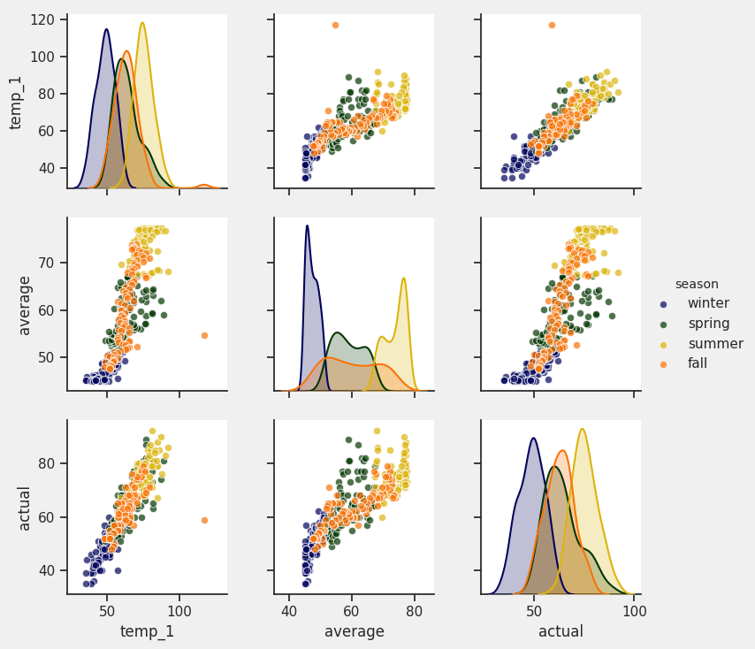

# Random Forest example

This example features the work of [Will
Koehresen](https://towardsdatascience.com/@williamkoehrsen) in [Random
Forest in
Python](https://towardsdatascience.com/random-forest-in-python-24d0893d51c0).

Refer to [`guild.yml`](guild.yml) for how the operations are defined.

The code being run by both [`prepare-data`](prepare_data.py) and
[`train`](train.py) is refactored from the original blog post.

- Logical operations are defined in functions
- Argparse is used to implement a command line interface

## Run operations

To run the example, change to this directory and run:

    $ guild run prepare-data
    $ guild run train

To list generated runs:

    $ guild runs

## View results

To list files generated by an operation:

    $ guild ls [RUN]

By default, Guild shows files for the latest run. You can specify a
run ID (the hash value) or a run index (the 1-based index shown in the
run listing). For example, to show files for the run with index 2 (the
`prepare-data` run), use `guild ls 2`. You can also specify the run
operation. To show files for the latest `prepare-data` operation:

    $ guild ls -o prepare-data

If you're running Guild on a desktop, you can open a run directory to
view files:

    $ guild open -o prepare-data

The plots generated in the original blog post are saved to files in
this example. Use your file browser to view them. You can
alternatively open them directly:

    $ guild open -o prepare-data -p pairplots.png

## Hyperparameter optimization

To perform the default optimization run of 20 trials using Bayesian
optimization, run:

    $ guild run train --optimize

The default search range for the optimization is defined in
`guild.yml`.

To compare runs:

    $ guild compare -o train

When comparing runs, you can sort by a paricular column by first
navigating to the column using the right and left arrows and then
pressing either 1 (for ascending order) or 2 (for descending
order). For this example, navigate to the far right column `val_acc`
and press 2 to view the runs in ascending order.

## References

- https://towardsdatascience.com/random-forest-in-python-24d0893d51c0
- https://towardsdatascience.com/hyperparameter-tuning-the-random-forest-in-python-using-scikit-learn-28d2aa77dd74
